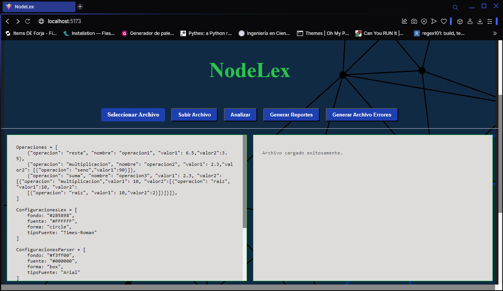

# Manual Técnico - NodeLex

## Descripción General
NodeLex es una aplicación web que realiza análisis léxico y sintáctico de archivos de entrada. La aplicación está construida utilizando Node.js y Express, proporcionando una API REST para el procesamiento y análisis de archivos.

## Ejecutar el programa

Navegar en una terminal hasta ambas carpetas del frontend y backend y ejecutarlas

Ejecutar backend

Ejecutar frontend

Luego de esto, se va a un navegador y se ingresa la direccion:
` http://localhost:5173`

Y aparecerá esto:

---

En los botones selecciona ` Seleccionar archivo`
y luego en `Subir Archivo`

Ahora se habra enviado el archivo hacia el backend, luego de esto se presiona el boton analizar, indicará que se analizo el archivo.

Aparecera la tabla de tokens abajo de los textarea

Ahora le puedes presionar el boton de ` Generar Reportes ` y/o `Generar Archivo Errores `
Estos generarán sus respectivos archivos y estarán en la carpeta del backend

Para terminar el programa se cierran las terminales en las cuales se estan ejecutando ambos, el backend y el frontend.