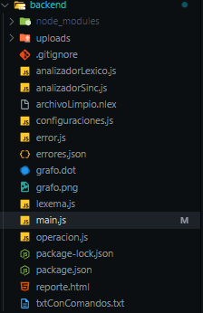
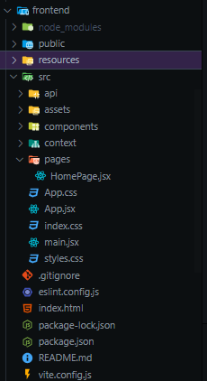

# Manual Técnico - NodeLex

## Descripción General
NodeLex es una aplicación web que realiza análisis léxico y sintáctico de archivos de entrada. La aplicación está construida utilizando Node.js y Express, proporcionando una API REST para el procesamiento y análisis de archivos.

## Requisitos del Sistema
- Node.js
- Express.js
- Módulo File System (fs)
- Body Parser
- Multer para carga de archivos
- Soporte CORS
- GraphViz (para generación de reportes)
- React
- Vite
- Axios
- CSS
- React counter

## Arquitectura

### Componentes Principales
1. **Backend**


2. **Frontend**

## Backend



#### Variables Globales
```javascript
let datosGlobalString = '';
let datosGlobalFile = '';
let lexemas = [];
let errores = [];
let operacionesArray = [];
let textoSinErrores = '';
let configuraciones = {};
let configLex = [];
let configPar = [];
let operacionesGlobal = [];
```

#### Clases
* configuraciones.js
* error.js
* lexema.js
* main.js
* operacion.js

### Endpoints de la API

#### 1. Carga de Archivos
```
POST /cargarArchivo
```
- Acepta carga de archivos
- Almacena archivos en el directorio uploads
- Retorna mensaje de éxito/error

#### 2. Análisis de Texto
```
POST /analizarTexto
```
- Realiza análisis léxico del archivo cargado
- Retorna lexemas y errores encontrados

#### 3. Generación de Errores
```
POST /generarErrores
```
- Genera archivo JSON con errores léxicos
- Retorna reporte de errores

#### 4. Generación de Reportes
```
POST /generarReportes
```
- Genera reportes visuales usando GraphViz
- Crea archivos DOT y visualizaciones PNG

### Funciones Principales

#### Analizador Léxico
`analizadorLexico(texto)`
- Procesa el texto de entrada carácter por carácter
- Identifica tokens y lexemas
- Maneja:
  - Números
  - Letras
  - Caracteres especiales
  - Comentarios
  - Palabras reservadas
  - Espacios en blanco y saltos de línea

#### Analizador Sintáctico
`analizadorSintactico(texto)`
- Valida la estructura sintáctica
- Verifica corchetes, paréntesis y llaves coincidentes
- Procesa operaciones y configuraciones
- Detección y reporte de errores

#### Procesamiento de Operaciones
`realizarOps()`
- Evalúa operaciones matemáticas
- Maneja operaciones anidadas
- Soporta operaciones:
  - Suma
  - Resta
  - Multiplicación
  - División
  - Potencia
  - Raíz
  - Funciones trigonométricas
  - Módulo

#### Generación de Reportes
`generarReportesGraphviz()`
- Crea representaciones visuales de operaciones
- Genera archivos DOT para GraphViz
- Apariencia personalizable de nodos:
  - Color de fondo
  - Color de fuente
  - Forma
  - Tipo de fuente

### Manejo de Errores
- Detección de errores sintácticos
- Seguimiento de corchetes/paréntesis faltantes
- Identificación de caracteres inválidos
- Registro y reporte de errores

### Configuración
El sistema soporta dos tipos de configuraciones:
1. **Configuraciones Léxicas** (ConfiguracionesLex)
   - Color de fondo
   - Color de fuente
   - Forma
   - Tipo de fuente

2. **Configuraciones del Parser** (ConfiguracionesParser)
   - Configuraciones personalizadas del analizador

### Archivos de Salida
- `errores.json`: Contiene reportes de errores
- `archivoLimpio.nlex`: Archivo de entrada limpio
- `grafo.dot`: Archivo DOT de GraphViz
- `grafo.png`: Representación visual de operaciones
- `Tabla de lexemas`: Representación visual de los lexemas en HTML


### Dependencias Backend
```json
{
  "express": "Requerido para servidor web",
  "fs": "Operaciones del sistema de archivos",
  "body-parser": "Análisis del cuerpo de la petición",
  "multer": "Manejo de carga de archivos",
  "cors": "Compartir recursos entre orígenes cruzados"
}
```

## Frontend


# Manual Técnico - Frontend NodeLex
## Aplicación Web con Vite + React

### 1. Descripción General
NodeLex es una aplicación web desarrollada con Vite y React que proporciona una interfaz para el análisis léxico de archivos. La aplicación permite cargar archivos, analizarlos y generar reportes de errores y análisis.

### 2. Tecnologías Utilizadas
- **Vite**: Framework de desarrollo para React
- **React**: Biblioteca JavaScript para construcción de interfaces
- **Axios**: Cliente HTTP para realizar peticiones al backend
- **React Router**: Manejo de navegación
- **CSS**: Estilos personalizados

### 3. Estructura de Componentes

#### 3.1 HomePage (HomePage.jsx)
Componente principal que maneja la funcionalidad core de la aplicación.

**Estados principales:**
```javascript
const [file, setFile] = useState(null);              // Almacena el archivo seleccionado
const [fileContent, setFileContent] = useState('');   // Contenido del archivo
const [analysisResult, setAnalysisResult] = useState(null); // Resultado del análisis
const [errorMessage, setErrorMessage] = useState(''); // Mensajes de error
const [outputContent, setOutputContent] = useState(''); // Contenido de salida
```

### 4. Funcionalidades Principales

#### 4.1 Manejo de Archivos
```javascript
const handleFileChange = (event) => {
    const selectedFile = event.target.files[0];
    setFile(selectedFile);
    // Lectura del archivo usando FileReader
    if (selectedFile) {
        const reader = new FileReader();
        reader.onload = (e) => {
            setFileContent(e.target.result);
        };
        reader.readAsText(selectedFile);
    }
};
```

#### 4.2 Carga de Archivos al Servidor
```javascript
const handleFileUpload = async () => {
    const formData = new FormData();
    formData.append('file', file);
    
    try {
        const response = await axios.post('http://localhost:3000/cargarArchivo', formData);
        setOutputContent((prev) => prev + '\nArchivo cargado exitosamente.');
    } catch (error) {
        setErrorMessage('Error uploading file');
    }
};
```

#### 4.3 Análisis de Texto
```javascript
const handleAnalyze = async () => {
    try {
        const response = await axios.post('http://localhost:3000/analizarTexto');
        setAnalysisResult(response.data);
    } catch (error) {
        setErrorMessage('Error analyzing text');
    }
};
```

### 5. Endpoints Utilizados

| Endpoint | Método | Descripción |
|----------|---------|------------|
| `/cargarArchivo` | POST | Carga el archivo al servidor |
| `/analizarTexto` | POST | Realiza el análisis léxico |
| `/generarErrores` | POST | Genera JSON de errores |
| `/generarReportes` | POST | Genera reportes de análisis |

### 6. Interfaz de Usuario
La interfaz se compone de:
- Área de título "NodeLex"
- Botones de control para las operaciones principales
- Dos áreas de texto:
  - TextArea de entrada (muestra contenido del archivo)
  - TextArea de salida (muestra resultados de operaciones)
- Tabla de resultados del análisis
- Tabla de errores encontrados

### 7. Manejo de Errores
La aplicación implementa un sistema de manejo de errores que:
- Muestra mensajes de error en la interfaz
- Registra errores en la consola para debugging
- Actualiza el área de salida con mensajes de error
- Mantiene al usuario informado del estado de las operaciones
